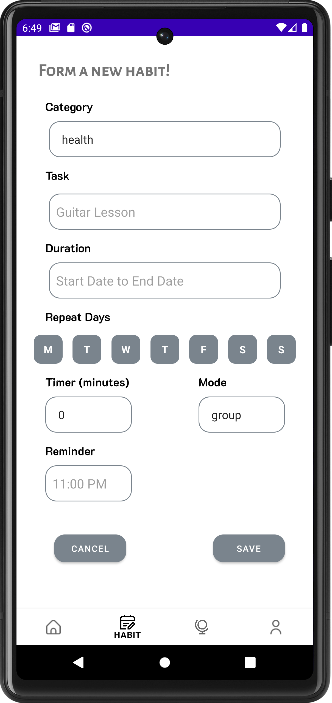
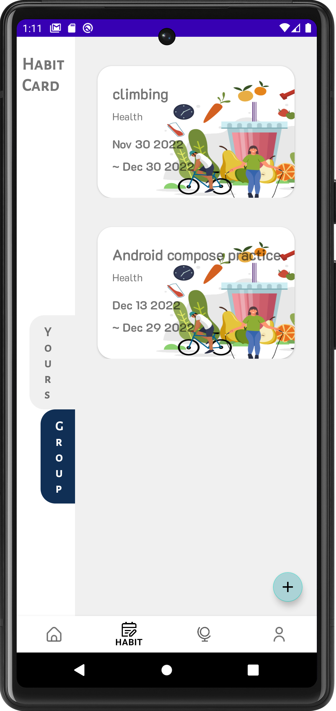
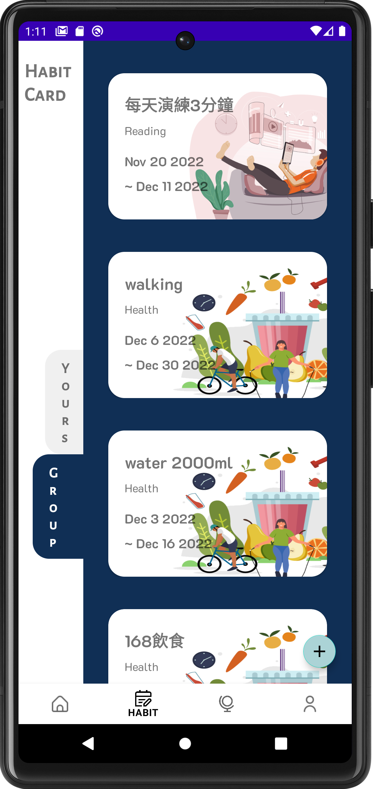
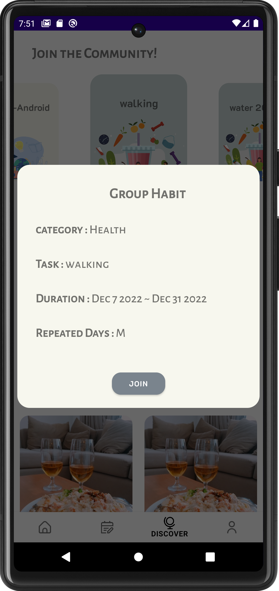
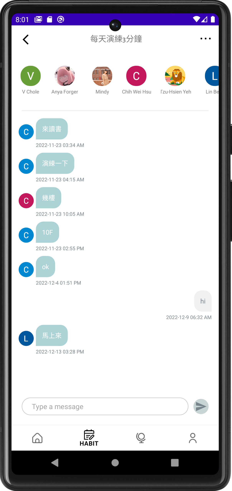
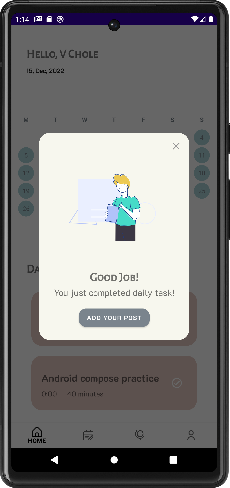
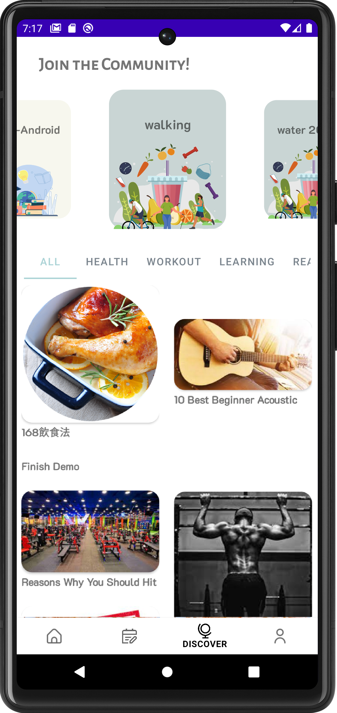
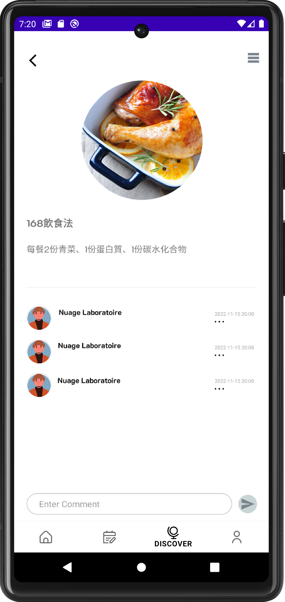

# myHa &ensp; 

> It is a habit tracker enabling users to develop good habits. It not only has the function of establishing personal habits, but also can find habitual friends through the concept of group interaction.

&nbsp;

## Features

####  Create Habit
1. Users can create personal habit cards or group habit cards based on categories
2. Multiple habit cards can be created at the same time.

   

&nbsp;
#### Join Community 
1. Users can enter the chat room after joining the group card；
2. Through the function of group chat and interaction, you can encourage teammates to form good habits and achieve same goals together.

  

&nbsp;
#### Create Post and add your comment
1. After completing the daily task, you can post the article；
2. On Discover Page, you can browse the posts of other users and interact with them by leaving messages for your opinon.

  

&nbsp;
&nbsp;

## Technical Highlights 

* Structured by **MVVM** through **ViewModel** and **LiveData** to enhance
maintainability and readablity
* Used **RecyclerView** with **StaggeredGridLayoutManager** to
complete waterfall layout
* Applied **ViewPager** and **TabLayout** for screen slides on multiple
pages for better user experience
* Used **CenterZoomLayoutManager** to scale up the center item in
RecyclerView
* Uploaded images on **Firebase Storage** to save the image URLs on
cloud stroage
* Utilized **Applandeo Calendar** to highlight even task
* Used **Firestore SnapshotListener** to synchronize real-time chat
room with low-latency database
* Implemented **Google Login** to enable user quickly to sign-in
* Analyzed the completion of habits by using **Williamchart**
* Loaded images and cached images with **Glide** for displaying on UI
* Implemented **Lottie** and **Animator** for motion effect

&nbsp;
&nbsp;
## Implementation

* Design Pattern 
    MVVM

* Jetpack
    Navigation
    LiveData
  
* User Interface
    RecyclerView
    ViewPager

* Tools
    Firebase `Authentication` `Firestore` `Storage` `Crashlytics`
    Glide

* Third Party Libraries
   [Lottie](https://github.com/airbnb/lottie-android)
   [Applandeo Calendar](https://github.com/Applandeo/Material-Calendar-View)
   [Williamchart](https://github.com/diogobernardino/williamchart)
  

&nbsp;
&nbsp;
## Requirements

* Android SDK 26

## Contact

Email: cv619115@gmail.com  
Linkedin: www.linkedin.com/in/cleo22

